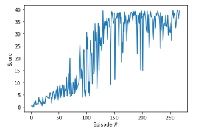

## Report

**Algorithm used:**
DDPG - Deep Deterministic Policy Gradients
 - DDPG is considered as an equivalent of **DQN for continuous control** problems. Hence it is an offline learning algorithm.
 - In DDPG we use **2 networks**, actor which learns the policy, which predicts the optimal action and a critic which learns the action value function Q, which is used to train the policy.
 - There are two copies of each, actior and critic, a local and a target copy, the local copy is up to date and the target copy is updated using the **soft-updates**, with TAU as mentioned below.
 - DDPG uses **Ornstein-Uhlenbeck Process** to add noise to the action output, **for exploration** in continuous action spaces. The hyperparameters used for noise generation are mentioned below with OU_ prefix.

**Model architecture:** Feed-forward network with 2 hidden layers each containing [400,300] neurons. For both actor and critic.

**Hyperparameters:**
- BUFFER_SIZE = 3e5
- BATCH_SIZE = 128
- GAMMA = 0.99
- TAU = 1e-3
- LR_ACTOR = 2e-4
- LR_CRITIC = 2e-4
- OU_MU = 0.
- OU_THETA = 0.15
- OU_SIGMA = 0.1

**Reward Plot**  
Averaged over 100 episode  

**Future Work**
- A3C/A2C using 20 parallel models trained.
