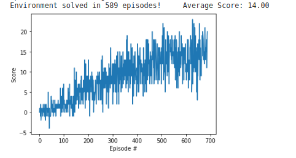

## Report

**Algorithm used:** Double DQN

**Model architecture:** Feed-forward network with 2 hidden layers each containing 64 neurons.

**Hyperparameters:**
- BUFFER_SIZE = 1e5
- BATCH_SIZE = 64
- GAMMA = 0.99
- TAU = 1e-3
- LR = 5e-4
- UPDATE_EVERY = 5

**Reward Plot**  
Averaged over 100 episode  

**Future Work**
- Prioritized experience reply
- Dueling DQN

